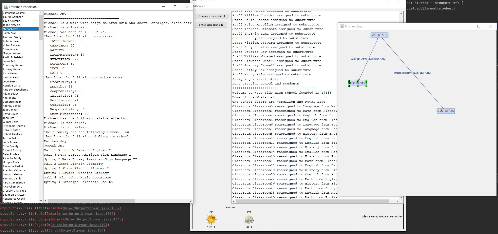

# generation_y2k

***Originally a school project that has been modified***

## Intro

This project is a detailed RPG/Slice-of-Life sim of an American high school which begins in the year 2004. The player
creates and controls the daily life of a unique student while the aspirations and goals of other generated students and
staff play out around them.

This project explores the use of GoF patterns:

I used a Builder design pattern to procedurally generate a high school and all specific rooms/ classrooms. Rooms are an
interface that serve as a template for specific room objects. A director object assembles the school by organizing a
series of concrete builders. From the builder, I used the school size (via number of classrooms and offices) to
calculate the maximum number of students and minimum number of staff needed to run a school.

Next, I developed an Abstract Factory to build different types of People (staff and students) using components that make
up a person, defined through an Interface. Students and staff are stored in separate hash maps for quick reference.
People are then generated with attributes and stats. There are no "races" in this, like a typical RPG, but students and
teachers have a chance at different base stats. Students and teachers can equip items to different parts of their bodies
which are objects in themselves.

I used a Singleton design pattern to generate days. The days act as a form of step within the state machine that is the
school and the people that attend/work at the school.

## School Generation

### Data Structure and Libraries for Rooms

Rooms are initially stored in a series of arrays (one for each room type) within the StandardSchool object. When the
Director spins up, it initiates a StandardSchool object, which fills these arrays with a random amount of each room
type. When rooms need to be connected, they are transferred to a 2-D array of Room objects called roomPool. We can
reference a particular room type within the pool by checking the int value on the first axis of the array which always
corresponds to a particular array of rooms. The **jgrapht** library is used to create a multigraph object for storing
vertices and edges. The multigraph is an undirected, unweighted graph. **Mxgraph** , **swing** and **jgrapht** are used
for generating a visualization of the graph after rooms are connected.

### Procedure

The layout of the high school is semi-procedurally generated. First, individual rooms are created. Then the "backbone"
of the school is constructed using hallways and courtyards. Hallways and courtyards are randomly connected using an
undirected graph. A connectivity inspector ensures that all backbone rooms are traversable from any other room. After
the backbone is constructed rooms are procedurally added to the backbone or other rooms in the following order:

- Athletic Fields
- Auditoriums
- Gyms
- Lunchrooms
- Libraries
- Music Rooms
- Art Rooms
- Drama Rooms
- Offices
- Student Bathrooms
- Classrooms
- Science Labs
- Computer Labs
- Utility Rooms
- Breakrooms
- Conference Rooms
- Parking Lots
- Vocational Rooms

The front office will always contain a connection to the principal and vice principal's office as well as the nurse's
office and any conference rooms. Breakrooms and planning rooms may be attached to the front office cluster in the
future. Science rooms will always have a connected lab. Gyms and fields will always have connections to two locker
rooms. Offices have a chance to be connected to classrooms. Computer labs will preference connecting to libraries. Drama
rooms have a chance of connecting to auditoriums.

Each room is an object that holds stats. First, student and teacher capacity is mainly determined by the number of
available classrooms. Each classroom can hold around 20 - 45 students and, generally, a school may contain anywhere from
18-60 classrooms. Rooms also contain a fixed number of connections/doors as well as windows (if it applies). If a
connection is made during the generation, then the number of available connections is reduced on each room by one. This
is meant to generate layouts that are more realistic. For example, classrooms shouldn't have more than a handful of
doors, adjacent rooms. Classrooms are randomly assigned types (science, math, english, social studies, homerooms). All
rooms are randomly assigned generated room numbers.

Rooms also have the ability to be off-limits to students, by setting the setStudentRestriction switch.

The school mascot is generated from a weighted list based on the most frequently to least frequently used mascots in US
high schools. The high school name is either a randomly generated person (presumably important in the fictionalized
community) or a randomly concatenated place name (Place1 + Place2) where, generally, most combinations make sense.

### Example of School Room Map

*Coming soon*

- School schedules/ bell schedule
- More status effects for people
- Items
- Moods / Allostatic load
- Nicknames
- Rival schools
- Household and personal traits
- Rumors
- School and extracurricular events
- Local businesses / points of interest
- Historical events
- Memories

## Student and Staff Stat Generation

### Data Structure and Libraries for People

Both staff and students are stored in their own HashMap<Integer, Person> objects. Students are further sorted into their
individual graduating classes after they are generated (i.e. freshmen).

### Procedure

Students and staff are comprised of individual body parts as described above. Once student and staff caps are known
based on the school layout, StudentPopGenerator and TeacherPopGenerator are called. They populate each hasmap with the
appropriate amount of people. An important component of each type of person is their respective "Stats" portion which
holds vital information for each individual to participate in the simulation. The stats portion also holds the name
generator. Each first and last name is generated by referencing a corresponding weighted distribution. This depends on
the individual's gender and birth year. For example, if a person was born 1989-01-12 and is a male, then "yob1989.txt"
will be referenced. These "yob" files contain U.S. census data from a corresponding year of a list of names from most to
least frequently used. This is meant to generate relatively accurate populations of students. Similarly, other physical
characteristics, such as height, eye color and hair color are relatively accurate to the US population. Height is a
normalized distribution based on age and gender.

### Example Student Generation

An example of a student generated and displayed in the inspector:

### Example Staff Generation

An example of a staff generated and displayed in the inspector:

## Datasets and References

- US Census Data for Surnames (Use File B) :  https://www.census.gov/topics/population/genealogy/data/2000_surnames.html
- US Census Data for First Names : https://www.ssa.gov/oact/babynames/limits.html (Use the National Data folder)
- US Mascot Frequency Database : https://masseyratings.com/mascots
- US Height Data Per Age Range : https://www.cincinnatichildrens.org/health/g/normal-growth
- Hair Color Distribution : https://beautytmr.medium.com/diversity-of-hair-types-b3615cec8ed8
- Hair Length Approximation : https://pubmed.ncbi.nlm.nih.gov/12644859/
- Eye Color Distribution : https://www.verywellhealth.com/what-is-the-rarest-eye-color-5087302
- US High School Colors
  Reference : https://www.quora.com/What-are-the-most-popular-high-school-color-combinations-in-the-US
- Hair types by race (
  General) : https://www.researchgate.net/figure/a-Demographics-of-sample-population-n-48-of-8-hair-curl-groups-Hair-geometric_fig1_317578316
- Skin tone and color
  descriptors : https://writingwithcolor.tumblr.com/post/96830966357/words-for-skin-tone-how-to-describe-skin-color
- Staff Averages Per School : https://nces.ed.gov/pubs2007/ruraled/tables/table3_12.asp
- Approximate Household income
  distribution : https://www.pewresearch.org/short-reads/2022/04/20/how-the-american-middle-class-has-changed-in-the-past-five-decades/
- Weather Data per region : https://www.ncei.noaa.gov/access/search/data-search/daily-summaries
- Student AP participation
  rates : https://newsroom.collegeboard.org/student-participation-and-performance-advanced-placement-rise-tandem#:~:text=The%20percentage%20of%20low%2Dincome,responsibilities%20for%20the%20College%20Board
  .
- Rates of male pattern baldness : https://pubmed.ncbi.nlm.nih.gov/9865198/
- Rates of gray hair per age bracket : https://pubmed.ncbi.nlm.nih.gov/22716034/
- Living arrangements of children in 2004 : https://www2.census.gov/library/publications/2008/demo/p70-114.pdf
- Rate of multiple births per
  ethnicity : https://www.statista.com/statistics/244913/twin-birth-rates-in-the-united-states-by-ethnicity/#:~:text=Fraternal%20twins%2C%20although%20born%20at,siblings%20born%20at%20different%20times.&text=The%20birth%20rate%20for%20twins,1%2C000%20live%20births%20in%202022
  .
- Trends in intermarriage : https://www.pewresearch.org/social-trends/2017/05/18/1-trends-and-patterns-in-intermarriage/
- Overview of Allostatic load : https://karger.com/pps/article/90/1/11/294736/Allostatic-Load-and-Its-Impact-on-Health-A
- Gender tables for 2004 : https://www.test.census.gov/data/tables/2004/demo/age-and-sex/2004-age-sex-composition.html

## Gameplay Mechanics

### Teacher and Student Stats

Student and teacher stats are comprised of the following primary stats. Primary stats are inherent to the characters and
do not change:

- INT / Intelligence: Mental ability of a person to grasp complex ideas, solve problems, and think abstractly. The
  intelligence base stat effects the capacity of Creativity, Empathy, Adaptability, Curiosity and Open-Mindedness.
  Intelligence distribution is based on an approximation of IQ where the average is 100 with a standard deviation of 15
  points.
- CHR / Charisma: A person's natural ability to influence others through speech, action or appearance. It may also apply
  to the presence of someone's personality, and the willingness for others to emulate or follow this person. The
  charisma base stat affects the capacity of Empathy, Responsibility and Open-Mindedness. Charisma distribution has an
  average of 50 with a standard deviation of 15.
- AGL / Agility: The mental or physical ability to quickly change direction, or evade potential hazards. The agility
  base
  stat effects the capacity of Adaptability. Agility may contribute to the ability to learn physical skills in the
  future.
  Agility distribution has an average of 50 with a standard deviation of 15.
- DET / Determination: This simulates a person's ability to focus on a physical or mental task despite outside pressure
  and adversity. Determination effects the capacity of Adaptability, Initiative, Resilience, and Responsibility.
  Determination
  has an average of 50 and a standard deviation of 15.
- PER / Perception: A person's ability to understand the intent of others, or predict the outcome of certain situations.
  Someone with a high PER might have a good "instinct" or strong "gut-feeling" about situations - sometimes without
  being
  fully-aware of what is wrong. Perception effects the capacity of Creativity, Initiative, and Curiosity. Perception
  distribution has an average of 50 and a standard deviation of 15.
- STR / Strength: This refers to someone's physical strength. Strength effects the cap for Resilience and may be
  important
  for learning physical skills in future updates.
- LCK / Luck: This represents the mysterious forces that work for or against someone. Some people may be naturally lucky
  or unlucky. People can be generated with negative or positive Luck, which act as a modifier on all rolls and skill
  checks. Luck distribution has an average of 0 (meaning the person is neither lucky nor unlucky) with a standard
  deviation
  of 10.

Secondary stats are derived from a combination of primary stats and are capable of being drained through activities or
events. Initial values for the secondary stats represent a maximum. Secondary stats can be recharged with rest or other
activities, but they cannot be pushed beyond their initial cap.

- CRE / Creativity: This represents a combination primarily of intelligence and perception. This is the max ability of a
  person to create solutions, projects, ideas etc. that are unique.
- EMP / Empathy: This is driven primarily by charisma and intelligence. This is the max ability of a person to
  understand the complex emotional states and situations of others.
- ADP / Adaptability: This is a combination of agility and intelligence, each which represent the physical and mental
  ability to adapt to new situations. Determination also plays a role in this cap.
- INT / Initiative: This stat is a combination of the determination to take action and the perception to see that an
  action needs to be taken. This is the max ability of someone to take action without the external influence of others.
- RES / Resilience: This stat is a combination of strength and determination. This is the max ability of someone to
  withstand the pressure or adversity of various events or peers
- CUR / Curiosity: This is a combination of primarily perception and intelligence. This represents a person's desire to
  not only understand the ideas and people around them, but also make useful connections between concepts
- RSP / Responsibility: This is a combination of charisma and determination. This not only represents a personal
  responsibility (to carry out daily tasks/ do socially responsible things) but also the ability to instill or influence
  responsible behavior in others.
- OPN / Open-Mindedness: This is a combination of intelligence and charisma. This represents the ability for the
  individual receive new ideas and accept situations and others that might exist outside their comfort-zone.

### Social Links

Students (and eventually teachers/staff) can have a number of social links that represent their feeling and status with
various people. Social links are bidirectional and weighted and fall within a range from -100 to 100.
A link of score 100, represents a strong attachment/ positive outlook towards that person, whereas a link of -100 would
mean the exact opposite (0 being neutral). Since links are bidirectional, it is possible for each party, in a
relationship, to feel differently about the other.
Social links cannot stand on their own and will require additional systems to provide context for relationships, but the
score acts as a core signifier of the relationship. Examples for how more context will flavor a relationship score would
be including a list of negative emotions associated with a low score. Additionally, consideration should be given
towards if a relationship is existing family, gender, and/or age (see examples).
People will be limited in the amount of social links they can carry based primarily on their Charisma stat.
People will likely have limits on how many relationships of each category they can hold. For example, a student may have
enough Charisma to maintain three best friends/strong relationships at any time, but may hold many more acquaintances or
casual relationships.
If a casual friendship were to get more serious, and they were elevated to a "best friend", then other best friend
relationships would begin to deteriorate at a quicker rate.

#### Examples:

Strong Positive and Neutral

Person A -> Person B : Social score 100

Person B -> Person A : Social score 0

Person B has a neutral opinion of Person A, or has no knowledge of Person A. Person A is not counted towards Person B's
social links count. However, Person A has a strong liking towards Person B, and does consume a social link for Person A,
since they hold a significant portion of Person A's thoughts.
This base social score could be used, to represent that Person A strongly admires a well-known, popular student (Person
B), or a younger sibling admiring their older brother/sister, or Person A is a student who has a strong, unrequited
crush on Person B.

Strong Positive and Strong Negative

Person C -> Person D : Social score > 75

Person D -> Person C : Social score < -75

This could be interpreted in a few ways depending on context. Person C could be friends with Person D, or at least
consider them as a best friend, whereas Person D is being intentionally deceitful in order to cause harm to Person C at
some point.
This link could also represent a sibling (Person C) that adores another sibling (Person D) who actively and routinely
hates them. With enough acts of betrayal, Person C will lose social score towards Person D. It may be possible the
opposite may occur, that Person D reverses their position over time.
Person C could possibly be an individual who has trouble interpreting social cues (low Perception, low Intelligence
etc.) and believes that most people are their friend despite repeated evidence showing otherwise.

Strong Negative and Neutral

Person E -> Person F : Social score < -75

Person F -> Person E : Social score 0

Person E actively hates Person F, but Person F has no opinion or barely knows Person E. This could be someone who feels
underrepresented in school hating a popular student, or someone who is jealous of a popular student who doesn't know
they exist.
This person (Person E) could also be a friend of someone who is being bullied or was broken up with by Person F, who
simply doesn't like someone because of what has been done to their friend.

Strong Positive and Strong Positive / Strong Negative and Strong Negative

These people are best friends or worst enemies, or frenemies. More mechanics will have to be developed to support
complexity in all of these relationships.

### Notes on Allostatic Load as a Future Gameplay Mechanic

I plan to use a real-world metric known as "allostatic load" which is a combination of multiple measurements that attempts to capture how repeated or chronic stressors affect the mind and body over time. For the purpose of this simulation, we will be using type 2 allostatic load, which is more tied to social/environmental factors.
Allostatic load in this simulation will likely be tracked through a single measurement on a fixed scale. While some sims rely on a "mood" meter to represent an individual's overall status, I believe it is important to include a metric such as allostatic load/overload to represent long-term stressors and their affects on the body, while allowing individuals to still experience different moods in the short-term.
It will be important to manage allostatic load in the game. Pushing a character too far will build allostatic load over time and lead to lasting negative effects. Allostatic load/overload can be mitigated through various strategies. Some people will be able to tolerate more load than others.
Repeated allostatic overload will likely reduce the overall amount of allostatic load a person may tolerate. 

## Known Bugs

- Graph visualization of rooms/social links can be hard to read due to overlapping labels
- Graph visualization of rooms/social links cannot handle dragging of connections/ allows connections to be moved
- Initial staff assignment is not efficient and sometimes runs out of available teachers
- Some teachers are not properly assigned a room
- Sometimes math classes are not assigned to freshmen
- Some last name capitalization is wrong
- Overcapacity rate in classrooms is relatively high/ some blocks still under 5 students assigned
- Student friend distribution not ideal

## Release 0.0.13

- Student traversal between classrooms has been mapped for each student. This will allow for chances to interact
  with other students and teachers between scheduled classes
- Students now have initial social links that are not just family members. This still needs work, but this is
  progress towards having a school-wide social network
- Student social connections can be viewed for the entire school
- Mostly refactoring and cleaning up issues in the code, including updating gradle version

## Release 0.0.12

- Initial social connection system has been stood up as bidirectional weighted graphs. Students are capable of having
  social connections with other students. Social connections can be visualized when clicking on a student in the
  inspection window. Currently, social connections only apply to generated siblings
- Fixes to seating assignment and bugs that occurred with multiple seat assignments for same student during the same
  block as well as seating visualizations for rooms without assigned staff such as parking lots.
- Gyms, auditoriums, fields and libraries can now have generated names ex. "Herbert J. Walker Stadium"
- Schools now have a founding year. Setting up for generation of historical events
- Many "magic numbers" used in various sim calculations have been centralized into constant fields. This will hopefully
  lay the foundation for generating schools via seeds in the future as well as lends to code readability and
  maintainability
- Fixed a missing perception stat for teachers/staff
- Most mutual sibling relationships have been fixed. Now, most siblings who have other siblings in school, should
  contain the same information (each sibling has the same listings of siblings in and out of school)
- Gender distribution based now on real census data. Table included as reference to affect gender distribution by age
  bracket in the future
- Clean up formatting and minor bugfixes

## Release 0.0.11

- Students now have vocational class assignments based on traits, which now means each student has a full schedule
- Teacher descriptions have been revised to account for age and a bug was fixed that used female hair length
  distributions for male teachers. Teachers are capable of having graying or gray hair as well as can be bald or balding
- Teachers now have a teaching experience stat based on number of years teaching
- An algorithm has been constructed to place students in seats for each classroom and block
- Last names are now properly capitalized and no longer all caps
- Last names have the possibility of being hyphenated
- Students now capable of having generated siblings (twins, triplets, half, step) that are either in or out of school.
  This forms the foundation for future social links feature
- Various bugfixes

## Release 0.0.10

- History, Science, Language, Vocational assignments completed for teachers
- Student class assignments completed for most grades and requirements
- Student and staff lists now displayed alphabetically by last name
- Student inspection updated to show class schedule per student
- AP class assignments are now based on income level, intelligence, and determination
- AP class assignments are determined per class category
- Revisions to class assignment algorithms so that students are not assigned conflicting classes
- Math class assignment revisions for students
- Minor bugfixes on student and teacher assignments

## Release 0.0.9

- Teachers and students now can be assigned classes per block and semester
- Initial Math and English assignments for teachers
- Initial Math and English assignments for students based on graduation requirements, income level and intelligence
- Room inspector now shows student assignments per block/class
- Grid-based seating system implemented for rooms
- Revised student cap and staff cap calculations
- Various bugfixes

## Release 0.0.8

- Rooms within the school layout visualizer can now individually be inspected
- Room types reassigned based on Staff type
- Fixing UI weather icon scaling and missing icon bug
- Added weather description on hover
- Outlines for bell schedule and grad requirements created
- Added hexcodes for school colors to be used in future systems
- Fix temperature display bug
- Student cap bug fix where student cap was 0 for specific rooms

## Release 0.0.7

- New system : Weather
- Staff inspection for individual staff
- Student inspection for individual students
- AM and PM weather displayed in main view
- Basic UI cleanup

## Release 0.0.6

- New stat : Luck (LCK)
- Students now have initial family income levels when generated
- Staff assignments tweaked to be less wasteful
- Basic room inspection added in Inspector
- Staff are now assigned to specific rooms
- GUI prototype has been constructed and output has been moved away from reporting to console
- GUI updates in realtime as school is generated
- Java project SDK upgraded from 11 to 17

## Release 0.0.5

- New room types: vocational rooms
- Generated staff are now assigned responsibilities
- Added a framework of possible classes that students can be enrolled in
- Added outlines and ideas for characteristic traits
- Some students may have suffixes (Jr, II, III, IV)

## Release 0.0.4

- Hair color, skin color, hair type distributions are now dependent on and weighted by race
- Added school colors and more names to school name randomizer. Schools may now only have one name (i.e. Millennium High
  School)
- Fixed bug where all students had female hair lengths
- Some students may have vitiligo, alopecia, albinism, or heterochromia iridium

## Release 0.0.3

- Surnames are now a weighted choice based on US census data
- Students are assigned race based on surname distributions (reference app_c.csv)
- Performance fixes on student and staff name generation by reading docs into memory first
- Minor bug fixes

## Release 0.0.2

- Use string builder for student and staff inspection
- Staff and students have hair types and lengths
- Updated descriptions for students and staff to be more natural and informative
- Minor optimizations

## Release 0.0.1

- Procedurally generated schools can be populated by a number of students and staff
- Schools contain classrooms and room types, mascots, school colors, and a generated school name
- Students and staff have primary and secondary stats that are generated on a normal distribution
- Student and staff names are generated based on US census data
- School rooms are automatically connected and represented as a contiguous, undirected graph. It can be visualized
  through Swing/JGraphX
- Students are automatically sorted to appropriate grade levels based on birthdays
- Inspectors are available for debugging and viewing individual staff/students
- Time is represented and can be advanced by days/hours
- Basic quiz and test system to challenge student stat system

**Disclaimer:** *The story, all names, characters, and incidents portrayed in this game are fictitious and randomly
generated. No identification with actual persons (living or deceased), places, buildings, and products is intended or
should be inferred.* 
